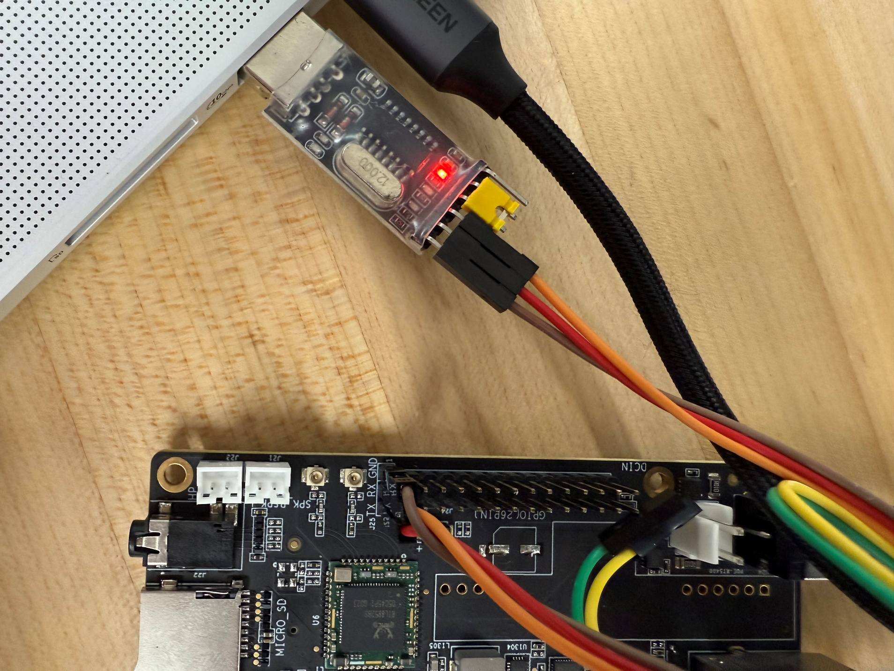
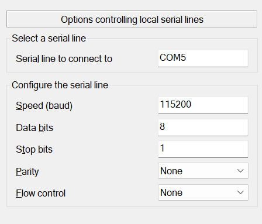
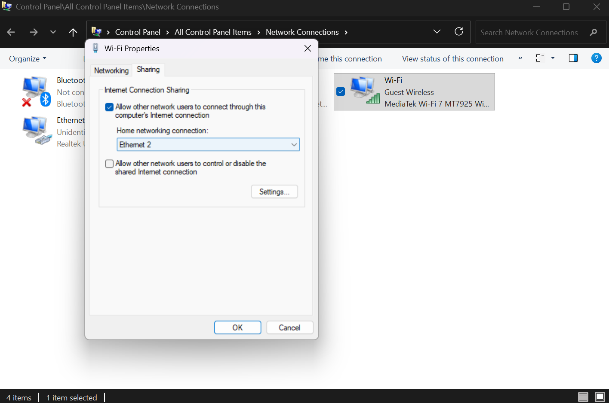
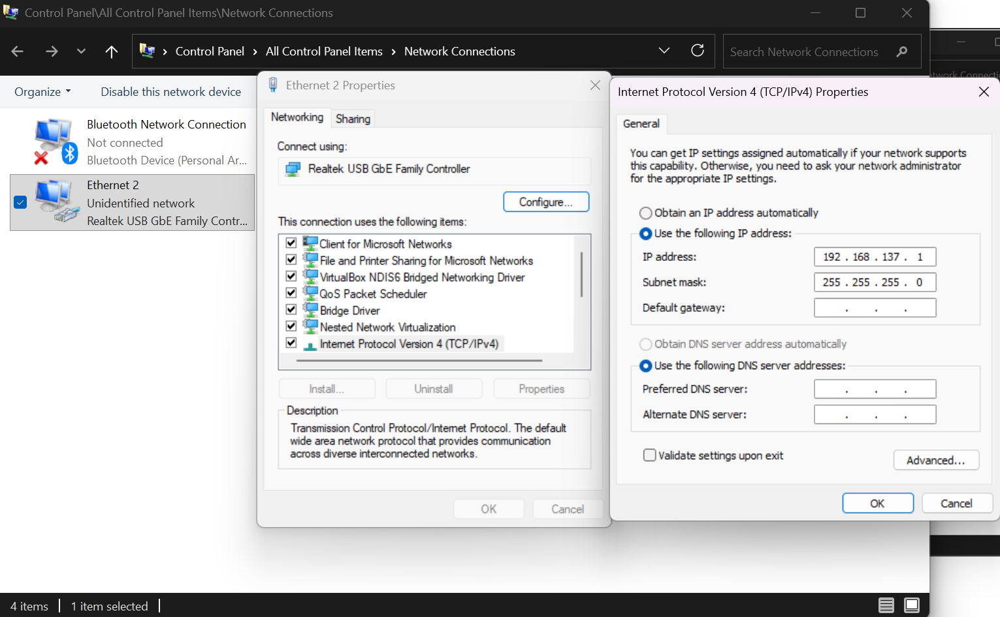

# Reptilian 37 – Documentation

Reptilian 37 is the next-generation educational OS for COP4600 that can run efficiently on
a RISC-V SBC. In our case, the device of choice is the Bananapi F3 (BPI-F3). it will:

- Offer a pared-down, secure distribution (Debian) with a reasonably sized footprint.
- Provide exam security features such as kernel signature verification and trusted computing
elements.
- Enable dual use: daily assignments in a lean environment and tamper-resistant in-class practical
assessments.

If you are a prospective developer of Reptilian 37, please reference the following documentation:

https://blog.bitsofnetworks.org/riscv-upstream-bpi-f3-part1-hardware/  
https://blog.bitsofnetworks.org/riscv-upstream-bpi-f3-part2-debian/  
https://developer.spacemit.com/documentation?token=GAmMwCrRUiZAo5kXKUQcNNacnwb&type=pdf  
https://docs.banana-pi.org/en/BPI-F3/BananaPi_BPI-F3  
https://docs.banana-pi.org/en/BPI-F3/BananaPi_BPI-F3#_source_code  
https://docs.u-boot.org/en/stable/board/spacemit/bananapi-f3.html  
https://stijn.tintel.eu/blog/2024/05/19/compiling-uboot-bpi-f3/  


---

## USERS
```
root : reptilian
nick17 : reptilian
```

---

## UART

Users can access **Reptilian 37** over UART via a small UART-to-USB breakout board.



UART is invaluable because it:

- Displays the full boot process  
- Provides a recovery path if the system is misconfigured  
- Gives BusyBox shell access if something goes wrong  
- Works as a fallback to SSH if networking breaks  

To make use of UART, use the following settings:



Be sure the COM port matches the one used on your host PC. This information can be found in Device Manager.

---

## NETWORKING

Networking on **Reptilian 37** is really convoluted. Here's the breakdown:

### **end0 (RJ45 1)**  
- DHCP enabled  
- Used for internet access  
- SSH access unreliable because the IP changes  

### **end1 (RJ45 2)**  
- Static IP: **`192.168.137.7`**  
- Chosen for compatibility with Windows Internet Connection Sharing  
- Reliable for SSH access  

### **wlan0 (RTL8852BS combo Wifi/BT module)**
- DHCP enabled
- Manually set up SSID/password in `/etc/network/interfaces`

---

### Enabling Windows Internet Sharing

Windows ICS (Internet Connection Sharing) allows you to share your device's internet connection over an ethernet cable, which can be extremely useful if the Wifi card on the Bananapi F3 is unresponsive or misconfigured (as it was for the majority of the Fall 2025 development cycle).

1. Press **Win + R**
2. Type `control ncpa.cpl`
3. Right-click your internet adapter → **Properties**
4. Go to the **Sharing** tab
5. Enable **Allow other network users to connect…**
6. Select the Ethernet adapter connected to the board



You may also need to configure a static IPv4 setup:



---

### `/etc/network/interfaces`

```
# interfaces(5) file used by ifup(8) and ifdown(8)
# Include files from /etc/network/interfaces.d:
source /etc/network/interfaces.d/*

# end0: DHCP from LAN or router
allow-hotplug end0
iface end0 inet dhcp
        metric 100

# end1: Static IP for direct connection bananapi <-> PC
allow-hotplug end1
iface end1 inet static
        address 192.168.137.7
        netmask 255.255.255.0
        gateway 192.168.137.1
        dns-nameservers 8.8.8.8
        metric 200

allow-hotplug wlan0
iface wlan0 inet dhcp
        #address 192.168.1.37
        #netmask 255.255.255.0
        #gateway 192.168.1.1
        #dns-nameservers 8.8.8.8

        wpa-ssid "someLizardReference"
        wpa-psk "passssword"
        metric 100
```

---

### `/etc/resolv.conf`

This file has been modified to use Google DNS:

```
# Generated by dhcpcd
# /etc/resolv.conf.head can replace this line
# /etc/resolv.conf.tail can replace this line
nameserver 8.8.8.8
```

---

### WiFi Notes

The BananaPi F3 uses an **RTL8852BS** combination wireless/bluetooth module.

It took me way too long to figure out that I just needed to probe the module to get Wifi working:

```
modprobe 8852
```

Thankfully, users don't have to worry about this. The module is now probed on boot automatically:

```
echo "8852" > /etc/modules-load.d/rtl8852bs.conf
```

---

## SECURITY

A folder **`/root/fitboot`** contains resources for FIT kernel signing. The following files need to be copied into the directory in order to create the signed kernel:

- `/boot/vmlinuz-6.6.63`
- `/boot/initrd.img-6.6.63`
- `/boot/spacemit/6.6.63/k1-x_deb1.dtb`

---

### Generate Signing Keys

NOTE: THIS HAS BEEN CHANGED. THE KEYS ARE NOW THE SAME AS THOSE THAT ARE USED IN `u-boot-2022.10/keys/`. PLEASE USE THOSE. THESE ARE LISTED FOR LEGACY PURPOSES.
```
openssl genpkey -algorithm RSA -pkeyopt rsa_keygen_bits:2048 -out uboot_signing_key.pem
openssl req -new -x509 -key uboot_signing_key.pem -out uboot_signing_key.crt -subj "/CN=BPI-F3-FIT-Signing/"
```

---

### `fitboot/kernel.its` — FIT Description File

```
/dts-v1/;

/ {
    description = "BPI-F3 FIT Signed Kernel";

    images {

        kernel {
            description = "Linux kernel";
            data = /incbin/("vmlinuz-6.6.63");
            type = "kernel";
            arch = "riscv";
            os = "linux";
            compression = "none";
            load = <0x600000>; 
            entry = <0x600000>; 
            hash-1 {
                algo = "sha256";
            };
        };

        fdt {
            description = "Flattened Device Tree";
            data = /incbin/("k1-x_deb1.dtb");
            type = "flat_dt";
            arch = "riscv";
            os = "linux";
            compression = "none";
            hash-1 {
                algo = "sha256";
            };
        };

        ramdisk {
            description = "Initramfs";
            data = /incbin/("initrd.img-6.6.63");
            type = "ramdisk";
            arch = "riscv";
            os = "linux";
            compression = "zstd";
            hash-1 {
                algo = "sha256";
            };
        };
    };

    configurations {
        default = "conf";

        conf {
            description = "BPI-F3 Signed Boot Config";
            kernel = "kernel";
            fdt = "fdt";
            ramdisk = "ramdisk";

            signature {
                algo = "sha256,rsa2048";
                key-name-hint = "rot";
                sign-images = "kernel", "fdt", "ramdisk";
                required = "conf";
            };
        };
    };
};
```

---

### Creating an Unsigned FIT

```
root@reptilian37:~/fitboot# mkimage -f kernel.its kernel_unsigned.itb
```
<!---
```
FIT description: BPI-F3 FIT Signed Kernel
Created:         Wed Dec  3 23:27:53 2025
 Image 0 (kernel)
  Description:  Linux kernel
  Created:      Wed Dec  3 23:27:53 2025
  Type:         Kernel Image
  Compression:  uncompressed
  Data Size:    34631680 Bytes = 33820.00 KiB = 33.03 MiB
  Architecture: RISC-V
  OS:           Linux
  Load Address: 0x00600000
  Entry Point:  0x00600000
  Hash algo:    sha256
  Hash value:   8209e4097bd7b277583c306b9a9cd3e60cb74653b97a07b29b59d26187c45772
 Image 1 (fdt)
  Description:  Flattened Device Tree
  Created:      Wed Dec  3 23:27:53 2025
  Type:         Flat Device Tree
  Compression:  uncompressed
  Data Size:    88384 Bytes = 86.31 KiB = 0.08 MiB
  Architecture: RISC-V
  Hash algo:    sha256
  Hash value:   80b227399c508dcfaeb2e8e8d688a0b156b81e67b7c74d7b77f051c97a52584b
 Image 2 (ramdisk)
  Description:  Initramfs
  Created:      Wed Dec  3 23:27:53 2025
  Type:         RAMDisk Image
  Compression:  zstd compressed
  Data Size:    27203605 Bytes = 26566.02 KiB = 25.94 MiB
  Architecture: RISC-V
  OS:           Linux
  Load Address: unavailable
  Entry Point:  unavailable
  Hash algo:    sha256
  Hash value:   21357d3c616a994d04888d1d10aa110bd13787c355f75e3f0ca1074f11accd3e
 Default Configuration: 'conf'
 Configuration 0 (conf)
  Description:  BPI-F3 Signed Boot Config
  Kernel:       kernel
  Init Ramdisk: ramdisk
  FDT:          fdt
  Sign algo:    sha256,rsa2048:rot (required)
  Sign value:   unavailable
  Timestamp:    unavailable
```
--->

---

### Signing the FIT

```
root@reptilian37:~/fitboot# mkimage -f kernel.its -k . -K kernel_unsigned.itb -r kernel_signed.itb
```
<!---
```
FIT description: BPI-F3 FIT Signed Kernel
Created:         Wed Dec  3 23:28:50 2025
 Image 0 (kernel)
  Description:  Linux kernel
  Created:      Wed Dec  3 23:28:50 2025
  Type:         Kernel Image
  Compression:  uncompressed
  Data Size:    34631680 Bytes = 33820.00 KiB = 33.03 MiB
  Architecture: RISC-V
  OS:           Linux
  Load Address: 0x00600000
  Entry Point:  0x00600000
  Hash algo:    sha256
  Hash value:   8209e4097bd7b277583c306b9a9cd3e60cb74653b97a07b29b59d26187c45772
 Image 1 (fdt)
  Description:  Flattened Device Tree
  Created:      Wed Dec  3 23:28:50 2025
  Type:         Flat Device Tree
  Compression:  uncompressed
  Data Size:    88384 Bytes = 86.31 KiB = 0.08 MiB
  Architecture: RISC-V
  Hash algo:    sha256
  Hash value:   80b227399c508dcfaeb2e8e8d688a0b156b81e67b7c74d7b77f051c97a52584b
 Image 2 (ramdisk)
  Description:  Initramfs
  Created:      Wed Dec  3 23:28:50 2025
  Type:         RAMDisk Image
  Compression:  zstd compressed
  Data Size:    27203605 Bytes = 26566.02 KiB = 25.94 MiB
  Architecture: RISC-V
  OS:           Linux
  Load Address: unavailable
  Entry Point:  unavailable
  Hash algo:    sha256
  Hash value:   21357d3c616a994d04888d1d10aa110bd13787c355f75e3f0ca1074f11accd3e
 Default Configuration: 'conf'
 Configuration 0 (conf)
  Description:  BPI-F3 Signed Boot Config
  Kernel:       kernel
  Init Ramdisk: ramdisk
  FDT:          fdt
  Sign algo:    sha256,rsa2048:rot (required)
  Sign value:   0961b430f9f172911273c763baa895817ae9019fc8c539b5610fdc6d2174406abf1b2815f98b7e231d75384dfe7a321b316be8bfb1d24ae53cc6f7b28a59ff272b706ce5b5166b8c4002a865649302e278134c171d8efde9d80f226930e72b1900bbf0587120139fadd776c1fb1c2cc990703367baddc292a2f5371016240b3b54f97dbd1961f60eacdf83265be5131b2d98aa77c3a2d140ec7586f9fcd69ef9e84454c14fd3adda29767a7a0f092a458b568a21a3bac59024fff3e2410ee27ecff900055a4e51188eb529dfd64e03a1be4f3bb31466d07a23f7426c9b16648c937d887059225dedd29ce96ca3750a7fc40f5fe36376de3ff5af6cd4b4bfc705
  Timestamp:    Wed Dec  3 23:28:52 2025
Signature written to 'kernel_signed.itb', node '/configurations/conf/signature'
Public key written to 'kernel_unsigned.itb', node '/signature/key-uboot_signing_key'
```
--->

---

### Boot Environment – `/boot/env-k1.txt`
The boot environment must be modified to load the kernel from eMMC's boot partition, `/dev/mmcblk2p5`:

```
knl_name=vmlinuz-6.6.63

ramdisk_name=initrd.img-6.6.63

dtb_dir=spacemit/6.6.63

bootargs=earlyprintk quiet splash plymouth.ignore-serial-consoles plymouth.prefer-fbcon clk_ignore_unused swiotlb=65536 workqueue.default_affinity_scope=system rootwait rootfstype=ext4 root=UUID=a7e88809-e382-4b28-acd4-2ed57abd378f earlycon=sbi console=ttyS0,115200n8 loglevel=8 rdinit=/init

bootcmd=mmc dev 2; ext4load mmc 2:5 ${kernel_addr_r} kernel_signed.itb; bootm ${kernel_addr_r}
```

---

### Example UART Boot Log with Signature Checking
If everything goes as planned, you should see the hash checks being performed over the UART boot log:

```
sys: 0x0
try sd...
bm:3
ERROR:   CMD8
ERROR:   sd f! l:76
bm:0
j...

U-Boot SPL 2022.10spacemit-dirty (Sep 09 2024 - 03:41:00 +0000)
[   0.166] DDR type LPDDR4X
[   0.176] lpddr4_silicon_init consume 10ms
[   0.177] Change DDR data rate to 2400MT/s
[   0.282] Boot from fit configuration k1-x_deb1
[   0.284] ## Checking hash(es) for config conf_1 ... OK
[   0.289] ## Checking hash(es) for Image uboot ... crc32+ OK
[   0.301] ## Checking hash(es) for Image fdt_1 ... crc32+ OK
[   0.322] ## Checking hash(es) for config config_1 ... OK
[   0.324] ## Checking hash(es) for Image opensbi ... crc32+ OK
[   0.362]

U-Boot 2022.10spacemit-dirty (Aug 15 2025 - 03:33:48 +0000), Build: jenkins-BSP-build-deb-751

...

[   1.050] Autoboot in 0 seconds
[   1.191] switch to partitions #0, OK
[   1.191] mmc2(part 0) is current device
[   1.426] 61926804 bytes read in 213 ms (277.3 MiB/s)
[   1.428] ## Loading kernel from FIT Image at 08000000 ...
[   1.434]    Using 'conf' configuration
[   1.437]    Verifying Hash Integrity ... OK
[   1.441]    Trying 'kernel' kernel subimage
[   1.445]      Description:  Linux kernel
[   1.449]      Type:         Kernel Image
[   1.453]      Compression:  uncompressed
[   1.457]      Data Start:   0x08000388
[   1.460]      Data Size:    34631680 Bytes = 33 MiB
[   1.465]      Architecture: RISC-V
[   1.468]      OS:           Linux
[   1.472]      Load Address: 0x00600000
[   1.475]      Entry Point:  0x00600000
[   1.479]      Hash algo:    sha256
[   1.482]      Hash value:   8209e4097bd7b277583c306b9a9cd3e60cb74653b97a07b29b59d26187c45772
[   1.491]    Verifying Hash Integrity ... sha256+ OK
[   2.083] ## Loading ramdisk from FIT Image at 08000000 ...
[   2.086]    Using 'conf' configuration
[   2.089]    Verifying Hash Integrity ... OK
[   2.094]    Trying 'ramdisk' ramdisk subimage
[   2.098]      Description:  Initramfs
[   2.101]      Type:         RAMDisk Image
[   2.105]      Compression:  zstd compressed
[   2.109]      Data Start:   0x0a11ce98
[   2.113]      Data Size:    27203605 Bytes = 25.9 MiB
[   2.118]      Architecture: RISC-V
[   2.121]      OS:           Linux
[   2.124]      Load Address: unavailable
[   2.128]      Entry Point:  unavailable
[   2.132]      Hash algo:    sha256
[   2.135]      Hash value:   21357d3c616a994d04888d1d10aa110bd13787c355f75e3f0ca1074f11accd3e
[   2.144]    Verifying Hash Integrity ... sha256+ OK
[   2.610] WARNING: 'compression' nodes for ramdisks are deprecated, please fix your .its file!
[   2.616] ## Loading fdt from FIT Image at 08000000 ...
[   2.622]    Using 'conf' configuration
[   2.625]    Verifying Hash Integrity ... OK
[   2.629]    Trying 'fdt' fdt subimage
[   2.633]      Description:  Flattened Device Tree
[   2.637]      Type:         Flat Device Tree
[   2.641]      Compression:  uncompressed
[   2.645]      Data Start:   0x0a107484
[   2.649]      Data Size:    88384 Bytes = 86.3 KiB
[   2.654]      Architecture: RISC-V
[   2.657]      Hash algo:    sha256
[   2.660]      Hash value:   80b227399c508dcfaeb2e8e8d688a0b156b81e67b7c74d7b77f051c97a52584b
[   2.669]    Verifying Hash Integrity ... sha256+ OK
[   2.674]    Booting using the fdt blob at 0xa107484
[   2.678]    Loading Kernel Image
[   2.698]    Loading Ramdisk to 7c38a000, end 7dd7b815 ... OK
[   2.719]    Loading Device Tree to 000000007c371000, end 000000007c38993f ... OK

Starting kernel ...

[    0.000000] Linux version 6.6.63 (root@bianbu-25.04-build-bsp-c48h8-pxdsc) (gcc (Ubuntu 14.2.0-19ubuntu2bb1) 14.2.0, GNU ld (GNU Binutils for Ubuntu) 2.44) #2.2.7.3 SMP PREEMPT Fri Aug 15 06:14:36 UTC 2025
...
```
## Getting the Signature Checking to Actually Mean Something

In its current state, U-Boot will indiscriminately boot the .itb file. It will perform the hash checks, but won’t do anything with the information. U-Boot and OpenSBI will need to be rebuilt to expand the root of trust to earlier in the boot process.

Thankfully, the source code used on the Bananapi F3, specifically for its Spacemit k1 SOC, is linked at `https://docs.banana-pi.org/en/BPI-F3/BananaPi_BPI-F3#_source_code`. We can use this instead of the generic DAS U-Boot repository. We'll also need to regenerate OpenSBI and pass the firmware, `fw_dynamic.bin` as an evironment variable during U-Boot compilation.
```
git clone http://gitee.com/bianbu-linux/uboot-2022.10.git
git clone https://gitee.com/spacemit-buildroot/opensbi.git
``` 

In the OpenSBI source directory, simply run `make PLATFORM=generic`. Bianbu's fork of OpenSBI doesn't seem to have any issues, but if you're attempting to use upstream OpenSBI, you may need to alter some platform options in `make PLATFORM=generic menuconfig`. Reference [Stintel's blog](https://stijn.tintel.eu/blog/2024/05/19/compiling-uboot-bpi-f3/) for more information.
Once in the U-Boot source directory, we can modify `configs/k1_defconfig` to include the appropriate options for strict signature checking:
```
CONFIG_FIT=y
CONFIG_SPL_FIT_SIGNATURE=y
CONFIG_SPL_FIT_SIGNATURE_REQUIRED=y
CONFIG_SHA256=y
CONFIG_RSA=y
CONFIG_RSA_VERIFY=y
CONFIG_SPL_SHA256=y
CONFIG_SPL_RSA=y
CONFIG_SPL_RSA_VERIFY=y
CONFIG_HASH=y
CONFIG_SPL_HASH=y
CONFIG_FIT_SIGNATURE=y
CONFIG_FIT_SIGNATURE_REQUIRED=y
```

Then, compiling U-Boot:
```
make k1_defconfig
make OPENSBI= <opensbi_dir>/build/platform/generic/firmware/fw_dynamic.bin -j$(nproc)
make -j$(nproc)
```

If successful, this will yield some very important files, namely `bootinfo_emmc.bin` and `FSBL.bin `. Earlier in the setup, we took these from Bianbu's factory configuration, but we'll need to use these now, since some of the information may have changed with respect to our new U-Boot configuration.

### Creating Root of Trust Keys

First, the BPI-F3 supports SHA-256 and RSA-2048. Let's generate our root of trust keys, and also save the public key hash. From the U-Boot source directory:
```
mkdir -p keys
openssl genrsa -out keys/rot.key 2048
openssl rsa -in keys/rot.key -pubout -out keys/rot.crt
openssl rsa -in keys/rot.crt -pubin -outform DER | sha256sum > rotpk_hash.txt
```

### Packaging into a Single File

Next, we'll need to package this into a signed U-Boot `.itb` and include the appropriate fdt, which for the BPI-F3 is `k1-x_deb1.dtb`. As usual, we'll do this with an `.its` file:

### `uboot-2022.10/uboot.its`
```
/dts-v1/;

/ {
    description = "U-Boot FIT image for k1-x_deb1 (signed)";
    #address-cells = <2>;

    images {
        uboot {
            description = "U-Boot";
            data = /incbin/("u-boot.bin");
            type = "standalone";
            arch = "riscv";
            os = "u-boot";
            compression = "none";
            load = <0x0 0x00200000>;
            hash-1 {
                algo = "sha256";
            };
        };

        fdt_1 {
            description = "k1-x_deb1";
            data = /incbin/("k1-x_deb1.dtb");
            type = "flat_dt";
            arch = "riscv";
            compression = "none";
            hash-1 {
                algo = "sha256";
            };
        };
    };

    configurations {
        default = "conf_1";

        conf_1 {
            description = "k1-x_deb1";
            loadables = "uboot";
            fdt = "fdt_1";

            signature {
                algo = "sha256,rsa2048";
                key-name-hint = "rot";
                sign-images = "loadables", "fdt";
            };
        };
    };
};
```

Then, we can create our signed U-Boot, and verify that a signature is present:
```
root@reptilian37:~/uboot-2022.10# mkimage -f u-boot.its -k keys -r u-boot_signed.itb
FIT description: U-Boot FIT image for k1-x_deb1 (signed)
Created:         Sat Dec 27 18:30:51 2025
 Image 0 (uboot)
  Description:  U-Boot
  Created:      Sat Dec 27 18:30:51 2025
  Type:         Standalone Program
  Compression:  uncompressed
  Data Size:    1364944 Bytes = 1332.95 KiB = 1.30 MiB
  Architecture: RISC-V
  Load Address: 0x00200000
  Entry Point:  unavailable
  Hash algo:    sha256
  Hash value:   d0fd662c435813f8524b28a6303653d6e68af5db29dfb0f443e8737c88129ed1
 Image 1 (fdt_1)
  Description:  k1-x_deb1
  Created:      Sat Dec 27 18:30:51 2025
  Type:         Flat Device Tree
  Compression:  uncompressed
  Data Size:    37518 Bytes = 36.64 KiB = 0.04 MiB
  Architecture: RISC-V
  Hash algo:    sha256
  Hash value:   26cb92114c0590f50be28cf9e231c3000663264e94964d21b142049285f9e2f4
 Default Configuration: 'conf_1'
 Configuration 0 (conf_1)
  Description:  k1-x_deb1
  Kernel:       unavailable
  FDT:          fdt_1
  Loadables:    uboot
  Sign algo:    sha256,rsa2048:rot
  Sign value:   99e4f19210f3bf99045fbd1c52c92329673cd63fb8f1b92a9b1f2a8d7ce105799bb140addcc438651116c6ea25d3641925fc78aee793355abbe4cb49325ee78019f1c0277071cd3f17cf297aa639914eb5e54a7579ef4bdfa5d0a6fbf949849d37ad2211c919b7f75aba92bae647c754df9d58b57938a99bf8fe4c0aa4c5d41ec861914ac9801f28dd4f6b88f07dfc428287439ec30a38a821155eec2888df3d3b5ade14dc689a6d25209e61c08957a378615fbda0f396567b7262eba1f08d29cae9b1f05269419beb892ee52ecd59d56105b18839c165b74949e0df8ba58f1fb9c4ab16fa35910b0b1336fb2b924704a2f951208c8009008b4563a551aed6e6
  Timestamp:    Sat Dec 27 18:30:51 2025
Signature written to 'u-boot.itb', node '/configurations/conf/signature'
```

### Flashing

The flashing process is the same as was done previously, now using our updated `bootinfo_emmc.bin`, `FSBL.bin`, and `u-boot-signed.itb`:

```
echo 0 > /sys/block/mmcblk2boot0/force_ro
dd if=bootinfo_emmc.bin of=/dev/mmcblk2boot0 bs=512 count=1
dd if=FSBL.bin of=/dev/mmcblk2boot0 bs=512 seek=1
dd if=u-boot_signed.itb of=/dev/mmcblk2p4 bs=64K status=progress
sync
reboot
```


## Secure Boot Tests

Hopefully, this will work successfully. And it does! For negative tests, we can also test with a minimally tampered U-Boot or kernel:

```
cp u-boot_signed.itb u-boot_signed_corrupt.itb
printf '\x00' | dd of=u-boot_signed_corrupt.itb bs=1 seek=4096 count=1 conv=notrunc
```

```
cp kernel_signed.itb kernel_signed_corrupt.itb
printf '\x00' | dd of=kernel_signed_corrupt.itb bs=1 seek=4096 count=1 conv=notrunc
```

### Failing Boot Log: Bad Hash Value (U-BOOT)
```
sys: 0x0
try sd...
bm:3
ERROR:   CMD8
ERROR:   sd f! l:76
bm:0
j...

U-Boot SPL 2022.10spacemit-dirty (Dec 27 2025 - 17:41:24 +0000)
[   0.160] DDR type LPDDR4X
[   0.161] set ddr tx odt to 80ohm!
[   0.182] lpddr4_silicon_init consume 22ms
[   0.183] Change DDR data rate to 2400MT/s
[   0.285] Boot from fit configuration k1-x_deb1
[   0.286] ## Checking hash(es) for config conf_1 ... OK
[   0.291] ## Checking hash(es) for Image uboot ... sha256 error!
Bad hash value for 'hash-1' hash node in 'uboot' image node
mmc_load_image_raw_sector: mmc block read error
mmc_load_image_raw_sector: mmc block read error
[   0.356] ## Checking hash(es) for config config_1 ... OK
[   0.359] ## Checking hash(es) for Image opensbi ... crc32+ OK
### ERROR ### Please RESET the board ###
```
### Failing Boot Log: Bad Hash Value (Kernel)
```
[   1.691] ## Loading kernel from FIT Image at 08000000 ...
[   1.697]    Using 'conf' configuration
[   1.700]    Verifying Hash Integrity ... OK
[   1.704]    Trying 'kernel' kernel subimage
[   1.708]      Description:  Linux kernel
[   1.712]      Type:         Kernel Image
[   1.716]      Compression:  uncompressed
[   1.720]      Data Start:   0x080000b8
[   1.723]      Data Size:    34631680 Bytes = 33 MiB
[   1.728]      Architecture: RISC-V
[   1.731]      OS:           Linux
[   1.735]      Load Address: 0x00600000
[   1.738]      Entry Point:  0x00600000
[   1.742]      Hash algo:    sha256
[   1.745]      Hash value:   8209e4097bd7b277583c306b9a9cd3e60cb74653b97a07b29b59d26187c45772
[   1.754]    Verifying Hash Integrity ... sha256 error!
Bad hash value for 'hash-1' hash node in 'kernel' image node
[   2.319] Bad Data Hash
ERROR: can't get kernel image!
```

From here, since no efuses have been burned at this point, we can still just reflash Bianbu's U-Boot from the SD card with a simple `dd` command. If the kernel is bad, then you'll have to mount the eMMC boot partition. From there, you hopefully have a safe kernel to boot back to, such as `kernel_signed.itb`. As usual, the particular kernel that gets loaded should be changed in `env_k1-x.txt`.